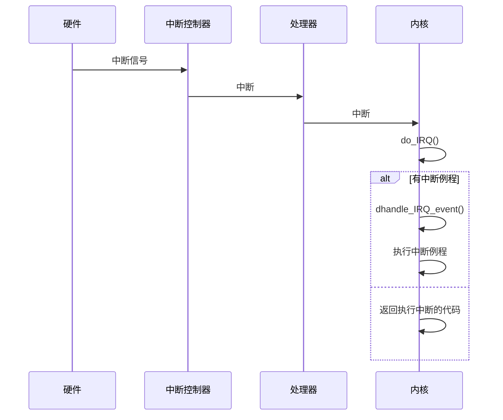
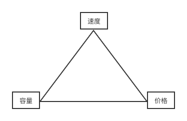
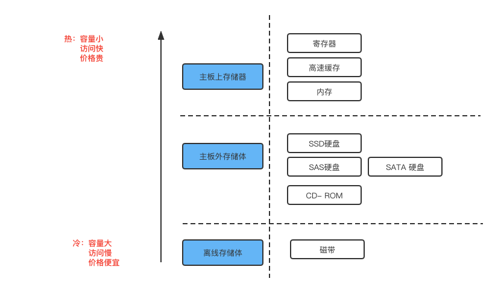
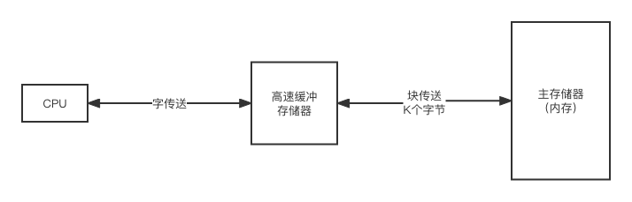

# 第一章 操作系统

操作系统利用一个或者多个处理器（CPU），响应、控制多种其它硬件资源（硬盘、网卡、声卡、键盘），执行各种指令，为用户提供服务。因此在了解操作系统之前，我们先来介绍下计算机系统的组成。

## 1.1 计算机系统

### 1.1.1 基本构成

从整体来看，计算机的组成结构如图：

<figure><figcaption><p>图一：计算机组成顶层图</p></figcaption></figure>

计算机有四个关键的组成：

1. 处理器（CPU）：控制计算机的操作，执行数据处理功能，是计算机的大脑。通常它指中央处理器。
2. 主存储器（内存）：存储运行中的数据和指令。该存储器中的数据是易丢失的，但是它的访问速度快。随着技术的发展，现在也有不易丢失的内存，NVDIM。
3. 输入/输出模块（I/O）：计算机外部数据进入到计算机内部的通道，比如网卡、键盘、音频设备。
4. 系统总线：为处理器和内存、I/O 模块之间提供数据移动（通信）的设施。

CPU的关键组成及其作用：

1. PC：程序计数器，包含将取指令的地址。
2. IR：指令寄存器，包含最近取的指令内容。
3. MAR：存储器地址寄存器，确定下一次读写的存储器地址。
4. MBR：存储器缓冲寄存器，包含要写入存储器的数据或者从存储器读取的数据。
5. I/O AR：I/O地址寄存器，确定一个特定的输入或者输出设备（硬盘、网卡、声卡）。
6. I/O BR：I/O缓冲寄存器，用于在I/O设备 和处理器交换数据。

### 1.1.2 指令执行

一个典型指令周期如图（图二：指令周期）所示：

<figure><figcaption><p>图二：指令周期</p></figcaption></figure>

比如要执行 3 + 5的指令，其步骤如下：

指令运行前存储器的状态：

存储器地址及其指令内容（值为16进制）

| 地址  | 指令内容 |
| --- | ---- |
| 100 | 1620 |
| 101 | 3621 |
| 102 | 4621 |
| 。。。 |      |
| 620 | 0003 |
| 621 | 0005 |

具体步骤：

| 步骤 | 取指阶段                                                                             | 执行阶段                                                                            |
| -- | -------------------------------------------------------------------------------- | ------------------------------------------------------------------------------- |
| 1  | <p>PC：包含第一条指令的地址 100。<br>IR： 包含地址100指向的指令内容。<br>PC：计算器增加1。<br>该过程利用到MAR和MBR。</p> |                                                                                 |
| 2  |                                                                                  | <p>IR：最初的4位（第一个16进制数）表层需要加载AC，剩下的12位表示地址620.<br>AC: 加载地址620对应的数据0003 寄存到AC。</p> |
| 3  | 从地址101 的存储单元中读取下一条指令（3621），PC 增1。                                                |                                                                                 |
| 4  |                                                                                  | AC中以前的内容和地址为621的存储单元中的内容相加，结果存储在AC中。                                            |
| 5  | 从地址102的存储单元中读取下一条指令（4621），PC增1。                                                  |                                                                                 |
| 6  |                                                                                  | AC中的内容被存储在地址621的存储单元中。                                                          |

指令运行后存储器的状态：

| 地址  | 指令内容 |
| --- | ---- |
| 100 | 1620 |
| 101 | 3621 |
| 102 | 4621 |
| 。。。 |      |
| 620 | 0003 |
| 621 | 0008 |

### 1.1.3 中断

中断有点类似仿生学。人的大脑对外界刺激的反应，是通过神经刺激。如果神经刺激过于激烈，大脑才会控制人去采取动作。比如，人被蚊子咬，由于被咬得太痛了，所以人会产生拍蚊子的动作。中断也类似，中断使得硬件得以与处理器进行通信。处理器接收中断后，会马上从操作系统反应此信号的到来，然后由操作系统负责处理这些新到来的数据。操作系统内核随时可能因为新到来的中断而被打断。

中断的分类：

<figure><figcaption><p>图三：中断分类</p></figcaption></figure>

从物理学的角度看，中断是一种电信号，不同的设备对应的中断不同，而每个中断都通过一个惟一的数字标识（中断值）。这些中断值在Linux 系统中被称为中断请求（IRQ）线。对于连接在PCI总线上的设备而言，中断是动态分配的，但是无论如何都要保证特定的中断总是与特定的设备相关联，并且操作系统内核知道这些信息。既然有中断、中断值（IRQ），那么就有中断处理程序（中断服务例程 ISR），其本质是一个函数，通过调用类似如下的函数，注册中断处理程序，让内核知道IRQ与ISR的关联信息。

```clike
// Some code
/**
* irq: 中断号
* handler：ISR 函数指针。
* irqflags：可以为0，是一个掩码
* devname：设备名称
* dev_id：共享中断线。 
*/
int request_irq(unsigned int irq,
                irqreturn_t (*handler)(int, void*, struct pt_regs*),
                unsigned long irqflags,
                const char * devname,
                void *dev_id);
/**
* irq: 中断号
* dev_id：共享中断线。 
* regs: 指向结构的指针，该结构包含中断前处理器的寄存器和状态。
*/                
static irqreturn_t intr_handler(int irq, void* dev_id, struct pt_regs* regs);               
```

那么操作系统如何处理中断，即中断路由：



### 1.1.4 存储器

计算机的存储器是用来存储数据的，存储器的设计目标可以归纳为3个关键问题：

1. 容量多大？
2. 速度多快？
3. 价格多贵？

这是一个三角约关系：

<figure><figcaption><p>图四 存储器三角约束</p></figcaption></figure>

解决这个三角约束问题的方法：分层思想——层次化存储。

<figure><figcaption><p>图五 分层存储</p></figcaption></figure>

### 1.1.5 高速缓冲

高速缓存体现了如何采用分层思想解决性能、容量、价格的问题。处理器在处理指令时至少访问一次存储器（内存），而且通常要多次访问存储器（内存）进行读取操作数或者保存结果。处理器执行指令的速度明显受限于存储周期时间（读、写一个字所花的时间）。这个限制成为一个严重的问题，解决方法就是利用分层和局部性原理，将热数据（即将访问的数据）存储在高速缓存器中，其原理如图：

<figure><figcaption><p>图六：高速缓冲存储器</p></figcaption></figure>

### 1.1.6 学到的思想

1. 局部性原理——预读、缓存。
2. 分层存储——多级缓存。
3. 队列思想——通过缓冲缓解高速写，缓解较慢的硬件短板问题。

## 1.2 操作系统

前面介绍了计算机的关键组成，那么一个程序（进程）如何跟这些关键硬件交互的？这里需要了解操作系统。
