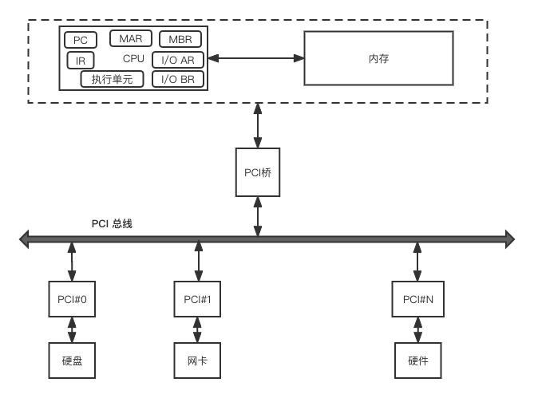
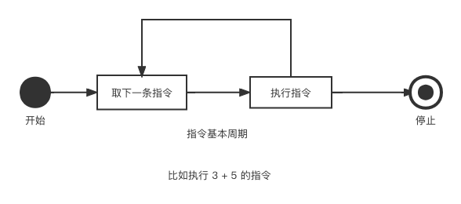

# 第一章 操作系统

操作系统利用一个或者多个处理器（CPU），响应、控制多种其它硬件资源（硬盘、网卡、声卡、键盘），执行各种指令，为用户提供服务。因此在了解操作系统之前，我们先来介绍下计算机系统的组成。

## 1.1 计算机系统

从整体来看，计算机的组成结构如图：

<figure><figcaption>
图一：计算机组成顶层图
</figcaption></figure>

计算机有四个关键的组成：

1. 处理器（CPU）：控制计算机的操作，执行数据处理功能，是计算机的大脑。通常它指中央处理器。
2. 主存储器（内存）：存储运行中的数据和指令。该存储器中的数据是易丢失的，但是它的访问速度快。随着技术的发展，现在也有不易丢失的内存，NVDIM。
3. 输入/输出模块（I/O）：计算机外部数据进入到计算机内部的通道，比如网卡、键盘、音频设备。
4. 系统总线：为处理器和内存、I/O 模块之间提供数据移动（通信）的设施。

CPU的关键组成及其作用：

1. PC：程序计数器，包含将取指令的地址。
2. IR：指令寄存器，包含最近取的指令内容。
3. MAR：存储器地址寄存器，确定下一次读写的存储器地址。
4. MBR：存储器缓冲寄存器，包含要写入存储器的数据或者从存储器读取的数据。
5. I/O AR：I/O地址寄存器，确定一个特定的输入或者输出设备（硬盘、网卡、声卡）。
6. I/O BR：I/O缓冲寄存器，用于在I/O设备 和处理器交换数据。

一个典型指令周期如图（图二：指令周期）所示：

<figure><figcaption>
图二：指令周期
</figcaption></figure>

比如要执行 3 + 5的指令，其步骤如下：

存储器地址及其指令内容（值为16进制）

| 地址  | 指令内容 |
| --- | ---- |
| 100 | 1620 |
| 101 | 3621 |
| 102 | 4621 |
| 。。。 |      |
| 620 | 0003 |
| 621 | 0005 |

具体步骤：

| 步骤 | 取指阶段                                                                             | 执行阶段                                                                            |
| -- | -------------------------------------------------------------------------------- | ------------------------------------------------------------------------------- |
| 1  | 
PC：包含第一条指令的地址 100。 IR： 包含地址100指向的指令内容。 PC：计算器增加1。 该过程利用到MAR和MBR。
 |                                                                                 |
| 2  |                                                                                  | 
IR：最初的4位（第一个16进制数）表层需要加载AC，剩下的12位表示地址620. AC: 加载地址620对应的数据0003 寄存到AC。
 |
| 3  | 从地址101 的存储单元中读取下一条指令（3621），PC 增1。                                                |                                                                                 |
| 4  |                                                                                  | AC中以前的内容和地址为621的存储单元中的内容相加，结果存储在AC中。                                            |
| 5  | 从地址102的存储单元中读取下一条指令（4621），PC增1。                                                  |                                                                                 |
| 6  |                                                                                  | AC中的内容被存储在地址621的存储单元中。                                                          |

## 1.2 操作系统

前面简单介绍了计算机组成部分，并通过例子执行 3 + 5 的计算指令，描述了一个完整的指令周期。

本章节，重点介绍操作系统。
